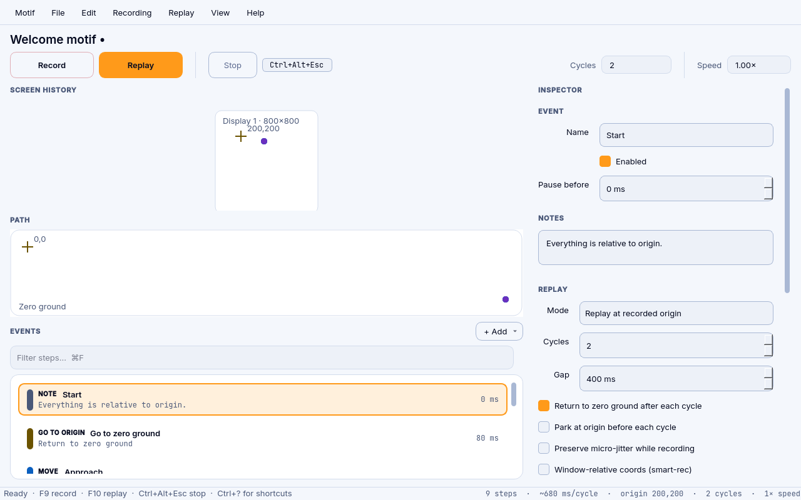
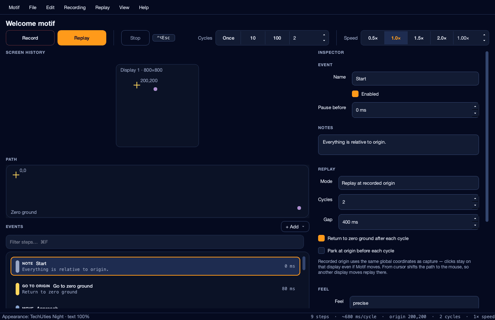
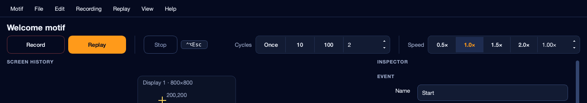

# Motif — mouse & keyboard recorder, auto clicker, and macro recorder

Motif is a **mouse & keyboard recorder**, auto clicker, and macro tool: record a take, edit the event list, replay it. **Works on macOS, Linux, and Windows** (Python core). macOS and Linux are GUI + pytest smoke-tested; Windows runs via `start.cmd` (portable EXE still forthcoming). Visual timeline, image/colour waits with optional click-on-find, light branches, humanized playback, tray/schedules, and an opt-in local API — TinyTask-style, not a Keyboard Maestro clone.

Also known as an auto clicker, keyboard recorder, click recorder, mouse macro, or input recorder.

## See it

Night theme with the example motif loaded (transport, path, event list, inspector):



Themes cycle (Night → Day → High Contrast):



Short preview video: [`docs/media/motif-themes.mp4`](docs/media/motif-themes.mp4)

Transport strip:



Day and High Contrast stills: [`motif-day.png`](docs/media/motif-day.png) · [`motif-high-contrast.png`](docs/media/motif-high-contrast.png)


## What Motif can do

TinyTask-style **record → edit → replay** for mouse and keyboard — not a full Keyboard Maestro replacement.

| Capability | What you get |
| --- | --- |
| **Record & replay** | Mouse moves, clicks, scrolls, keystrokes. Hotkeys **F9** record · **F10** replay · **⌃⌥Esc** stop |
| **Edit the take** | Event list + inspector, skip/reorder/duplicate, filter, visual path & screen history |
| **Loops & speed** | Cycle count and playback speed on the transport |
| **Humanize** | Feel presets: **Precise** / **Natural** / **Cautious** (path + timing jitter) |
| **Origin-relative coords** | Zero-ground origin so loops stay aligned; replay at recorded origin or from the current cursor |
| **Smart waits** | Wait for a **colour** or an **image** template; optional **click where it matched** (anchor corners/center) |
| **Light branches** | Event `label` + `on_found` / `on_miss`: continue, stop, or `goto:label` (jump-capped) |
| **Window-relative (smart-rec)** | Optional coords tied to a window — strongest on **macOS**; Linux/Windows degrade with a clear status |
| **Pro edit** | Split / merge moves, stretch delays; denser stroke sampling near clicks; preserve micro-jitter |
| **Display fingerprint** | Warns if the monitor layout changed since capture |
| **Tray, schedules, hotkey library** | Tray Show/Record/Replay last/Quit; daily or delay play while Motif runs; bind `.motif.json` files to custom global hotkeys |
| **Local API** | Opt-in `127.0.0.1:7842` for load/play/record/stop from scripts (no auth; localhost only) |
| **Accessibility** | Themes (Night / Day / High Contrast), text scale, full keyboard UI, WCAG-checked colours |
| **Platforms** | **macOS** (primary: Spaces, app switch, `Motif.app`) · **Linux** (GUI + pytest smoke) · **Windows** (same Python core via `start.cmd`; portable EXE later) |

Ship notes: [`docs/SHIP.md`](docs/SHIP.md) · dual-OS GUI smoke: `scripts/gui_smoke.py` · evidence grabs: [`docs/media/smoke/`](docs/media/smoke/)

## Start

**macOS:** open `Motif.app` (preferred — permissions attach to Motif). If it is missing, run `python3 start.py app` once, then open `Motif.app`. `Motif.command` is a fallback and will open `Motif.app` when it exists.

**Any terminal:**

```bash
python3 start.py
```

`start.cmd` (Windows) and a Linux launcher exist. **macOS and Linux are GUI + pytest smoke-tested**; Windows runs the same Python core via `start.cmd`. macOS remains primary for Accessibility, Spaces, and `Motif.app` packaging.

Requires **Python 3.11+**. The first run creates `.venv`, installs Motif, and opens the window. After that, the same command just starts. A terminal start on Mac still attributes Accessibility to Terminal/Python — use `Motif.app` for recording.

## macOS extras

These stay on Mac and are skipped (not faked) elsewhere:

- **Switch app** and **Spaces** — NSWorkspace / four-finger Mission Control capture and app activate
- **Motif.app** and **Install to Applications** — so Accessibility, Input Monitoring, and Screen Recording attach to Motif instead of Terminal
- Permission HUD / TCC prompts

Replay of a Mac-recorded Switch app / Space row off Mac does not invent a virtual-desktop gesture. It may post the stored Control+Arrow shortcut, or no-op if there is nothing to activate.

## Motif.app and Applications

Full ship checklist (macOS + Linux tarball): [`docs/SHIP.md`](docs/SHIP.md).

The project copy lives next to this README:

```
<this folder>/Motif.app
```

That stub is tied to this project’s `.venv`. A Finder copy into `/Applications` will not work.

To put Motif in Applications while still running this project:

```bash
python3 start.py install
```

or **Motif → Install to Applications** in the app.

That rebuilds the project `Motif.app` if needed, then installs `/Applications/Motif.app` with a bookmark back to this folder. After install, grant Accessibility, Input Monitoring, and Screen Recording to **that** Motif (`/Applications/Motif.app`), then open it from Applications.

- Project: `<this folder>/Motif.app` — fine to open while developing
- Applications: `/Applications/Motif.app` — same project, permissions attach to the Applications copy

## Manage

```bash
python3 start.py setup           # repair the install
python3 start.py app             # build Motif.app (macOS)
python3 start.py install         # install /Applications/Motif.app (macOS)
python3 start.py test            # run checks
python3 start.py play FILE       # play a saved motif
python3 start.py help
```

Hotkeys: **F9** record · **F10** replay · **⌃⌥Esc** stop (Control+Option+Escape on Mac, Control+Alt+Escape elsewhere). Esc still stops when Motif is focused.

## Keyboard

Every control is reachable with Tab — the transport included. **Ctrl+?** opens the full list in the app.

| Keys | What it does |
| --- | --- |
| `F9` / `F10` | Record · Replay |
| `⌃⌥Esc` | Stop, even when Motif is not focused |
| `↑` `↓` | Select the previous / next step |
| `Alt+↑` `Alt+↓` | Move the selected step |
| `Space` | Skip or restore the selected step |
| `Ctrl+D` · `Delete` | Duplicate · remove |
| `Ctrl+F` | Filter steps (name, kind, key, app, or note) |
| `Ctrl+L` | Jump to the step list |
| `Ctrl+Shift+T` | Next theme |

The Path and Screen History views take focus too: arrow keys step through the events drawn in them, so neither view is mouse-only.

## Appearance and accessibility

**View → Appearance**, or Preferences.

- **Themes** — *TechUties Night* (default), *TechUties Day*, and *High Contrast*. Every text colour in all three clears WCAG AA against every surface it is drawn on, including disabled text on a selected row; body text clears AAA. `tests/test_engine.py` asserts the ratios, so a palette edit that breaks contrast fails the build.
- **Text size** — 100 / 115 / 130 / 150 %. Qt stylesheet pixels do not follow the OS text-size setting, so Motif carries its own. Controls grow with the type, and the transport drops its preset chips before anything clips — the Cycles and Speed number boxes always remain.

The toolbar reads in four zones, separated by hairline rules: **Record · Replay**, then **Stop** with the panic key, then **Cycles**, then **Speed**. Cycles and Speed are one control each — presets and a custom number box inside a single frame, not two widgets side by side — and every control in the row is the same height.
- Screen readers get names and descriptions on every control, and each step reads as one line: position, kind, name, detail, timing, and whether it is skipped.
- Focus is always visible: one amber ring, thicker in High Contrast.
- Status is never colour alone — a skipped step says `Off`, and the selected point on a canvas gets a ring, not just a tint.

Colours come from techuties.com: brand navy `#050A1F`, amber `#FF9A1A`, Inter where it is installed.


## Linux smoke

On Linux (CI or a second machine), Motif’s pytest UI cases need:

```bash
sudo apt-get install -y python3-dev build-essential libegl1 libgl1 \
  libxkbcommon0 libxcb-cursor0 libxcb-icccm4 libxcb-image0 libxcb-keysyms1 \
  libxcb-render-util0 libxcb-shape0 libxcb-xinerama0 libxcb-xfixes0
python3 -m venv .venv && . .venv/bin/activate
pip install -e '.[dev]'
QT_QPA_PLATFORM=offscreen python -m pytest
```

macOS remains the primary recorder/replay target (Accessibility / Spaces / Motif.app); Linux is smoke-tested for install, GUI launch, and the full pytest suite.


## GUI smoke

Exercise the window without Accessibility scripting:

```bash
python3 scripts/gui_smoke.py --out docs/media/smoke --prefix mac   # or linux
```

Uses Qt (`offscreen` or native). Writes theme grabs under `docs/media/smoke/` and a JSON summary. Live Motif can also be driven via localhost control (`/health`, `/load`, `/play`, `/record`, `/stop`) when enabled.

## Permissions

On **macOS**, grant these to **the Motif you opened** (project `Motif.app` or `/Applications/Motif.app` — not Terminal, Motif.command, or Python):

1. **Accessibility** — required to record and replay
2. **Input Monitoring** — required for global keyboard/mouse taps on recent macOS
3. **Screen Recording** — only for colour-pixel triggers

**Local Network is not required.** Motif does not start its localhost control server unless you turn that on.

Open Motif.app first so it appears in those lists. Use Help → Permissions in the app. Then **quit Motif and open the same Motif.app again** so the new rights apply.

If you previously allowed Terminal or Python, you can leave those on; Motif.app still needs its own ticks.

## Scripts

**Stroke quality:** recording samples denser when the cursor slows (near clicks). Enable *Preserve micro-jitter while recording* in the inspector to keep sub-3px tremor.

**Display resilience:** motifs store a display fingerprint; Motif warns in the status bar if the layout changed since capture.

**Pro edit:** Edit menu — Split Move, Merge Moves, Stretch Delays ×1.5 (`Ctrl+Shift+D`) on the selection.

**When image / colour:** `wait_image` and colour waits; optional **click when found** with corner/center anchor, plus continue/stop/`goto:label` branches on found or miss.


Motifs are saved as `.motif.json`. Coordinates are stored relative to a **zero-ground origin** so loops stay aligned if you move that origin. Values are **global logical points** on the whole virtual desktop (extra monitors included, Retina points not physical pixels).

**Replay at recorded origin** (default) plays back on the same display(s) you recorded, even if the Motif window is on another screen. **Replay from current cursor** shifts the whole path to wherever the mouse is — if you click Replay on a second monitor, that is where it runs.


## Capability packs (A–E)

Shipped as focused packs — still TinyTask-simple, not a scripting IDE:

- **A — Smart image click + branches** — `wait_image` / `wait_pixel` can click the match (anchor: center/tl/tr/bl/br). Optional event `label` with `on_found` / `on_miss`: `continue` | `stop` | `goto:<label>` (goto jumps capped per run). Inspector fields for template, threshold, click-on-find, anchor, branches.
- **B — Window-relative / smart-rec** — Optional mode stores window metadata and maps coords back into the live window on replay. macOS preferred (Quartz); Linux/Windows degrade with a clear status. Preferences + inspector toggle.
- **C — Tray + schedule + hotkey library** — System tray: Show, Record, Replay last, Quit. Bind saved motifs to custom global hotkeys (beyond F9/F10). Simple in-app daily/delay scheduler while Motif is running. Preferences persist all of the above.
- **D — Humanization polish** — Precise / Natural / Cautious actually differ (path style + delay/path jitter). Clear Feel tooltips. Seeded tests assert preset differences.
- **E — Ship / portable** — macOS ship checklist in [`docs/SHIP.md`](docs/SHIP.md) (`start.py app` / `install`). Linux: [`scripts/linux-bundle.sh`](scripts/linux-bundle.sh) tarball recipe. Optional ad-hoc codesign note only — no Apple cert required. Windows: brief future note.

## Humanize feels

- **precise** — recorded path, no extra path/delay jitter (default TinyTask-faithful replay).
- **natural** — bezier travel with light timing, click, and path jitter.
- **cautious** — overshoot paths, slower Fitts travel, stronger jitter for “careful” UI.
- **custom** — pick Default path yourself; Motif marks Feel as custom when you diverge from a preset.

## External trigger / Local API

Local control is **off by default** so macOS does not prompt for Local Network access. Recording and replay work without it.

**Motif must be running.** Then turn on **Motif → Enable Local Control (localhost)** (or Preferences). Other programs on this machine can call:

```
http://127.0.0.1:7842
```

There is **no authentication**. The server binds to localhost only. Do not expose that port (no reverse proxy, no `0.0.0.0`). Browser pages from other origins are rejected; `curl` and local scripts (no `Origin` header) are the intended clients.

| Method | Path | What it does |
| --- | --- | --- |
| GET | `/health` | `{ok, app}` |
| GET | `/status` | recording / playing, event count, current motif name |
| GET | `/script` | current motif JSON (includes recorded key names) |
| POST | `/play` | play the loaded motif; optional JSON `path` and `loops` |
| POST | `/stop` | stop play or record |
| POST | `/record` | toggle recording |
| POST | `/load` | load a file (`{"path":"…"}`) without playing |

There is **no play-by-name**. `/status` reports the current motif `name`; `POST /play` only accepts `path` and `loops`.

```bash
# currently loaded motif
curl -X POST http://127.0.0.1:7842/play

# a file (loads it, then plays)
curl -X POST http://127.0.0.1:7842/play \
  -H "Content-Type: application/json" \
  -d '{"path":"/absolute/path/to/script.motif.json"}'

# stop
curl -X POST http://127.0.0.1:7842/stop

# optional: loops, or load without playing
curl -X POST http://127.0.0.1:7842/play \
  -H "Content-Type: application/json" \
  -d '{"loops":3}'
curl -X POST http://127.0.0.1:7842/load \
  -H "Content-Type: application/json" \
  -d '{"path":"/absolute/path/to/script.motif.json"}'
```

**Keyboard Maestro / Shortcuts (macOS):** add a Run Shell Script action and paste one of the `curl` lines. Motif must already be open with local control on.

**CLI** (same machine): `motif play FILE` or `python3 start.py play FILE` talks to the running app when local control is on; if the GUI is not reachable it falls back to headless replay. `motif play FILE --headless` skips the API. `motif stop`, `motif status`, and `motif record` also hit the local server.

```python
from motif import MotifClient
MotifClient().play()
MotifClient().play("/absolute/path/to/script.motif.json", loops=3)
```

On macOS, when you trigger through the API, Accessibility / Input Monitoring / Screen Recording belong to **Motif.app**. Headless `motif play` (no GUI) attributes those to Terminal or Python instead.
